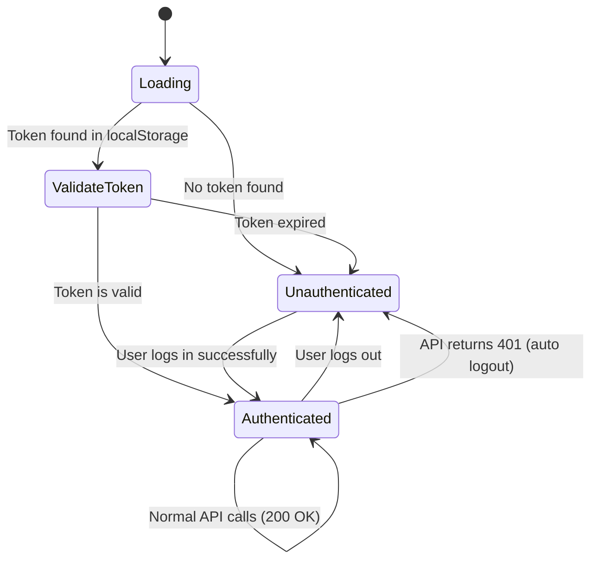

# R3almX Authentication Flow Diagram

This document illustrates the complete data flow and state management for user authentication in the R3almX application. The system is designed to be robust, efficient, and self-healing.

## The Three States of Authentication

The application can be in one of three primary states at any given time:

1.  **Loading**: The initial state when the app starts and we don't yet know if the user is authenticated.
2.  **Unauthenticated**: The state where the user is known to be logged out.
3.  **Authenticated**: The state where the user is successfully logged in and their token is valid.

---

## Diagram

## Key Takeaways from the Flow

1.  **Client-Side Validation on Load**: The app starts fast because it validates the token's expiration date on the client without a network request.
2.  **Server is the Authority**: The server is the ultimate source of truth. If the token is invalid for any reason (expired, tampered, revoked), the server will return a `401`, and the system will automatically log the user out.
3.  **Single Source of Truth (State)**: `AuthContext` is the single source of truth for the user's authentication state. All components rely on its `isAuthenticated` and `user` values.
4.  **Decoupled Components**:
    - `AuthContext` manages state.
    - `ProtectedRoute` manages routing based on that state.
    - `axios` interceptors manage API communication based on that state.
    - UI components trigger state changes by calling `login()` or `logout()`.

This creates a clean, predictable, and robust system.
